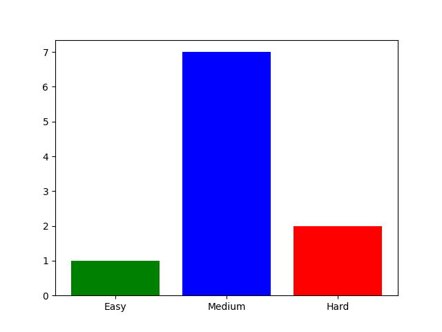

# 🛡️ Secure Question Paper Generation System


A modern **Python-based application** to automate the generation of encrypted, password-protected question papers based on CO (Course Outcomes), difficulty level distribution, and data integrity verification. Designed for educational institutions prioritizing security and efficiency.

---

## 🎯 Key Objectives (CO)

- ✅ Use core Python scripting with control structures and file handling
- 🧠 Build GUIs using `Tkinter` and `ttkbootstrap`
- 🔐 Demonstrate encryption using `AES`, `Fernet`, and PDF password protection
- 📊 Integrate difficulty level analytics with `matplotlib`
- 🧾 Apply MySQL and advanced Python data structures (extendable)
- 🧬 Leverage regular expressions for pattern-based question parsing

---

## 🖼️ Interface Preview



---

## 🧰 Features

| Module | Description |
|--------|-------------|
| 📝 **Question Generator** | Generates question paper from `.txt` file using CO tags and difficulty balance (Easy:Medium:Hard = 2:6:2) |
| 📁 **File Selection** | Supports separate file upload for Questions and COs |
| 🔐 **PDF Encryption** | PDF generation with password protection using `PyPDF2` |
| 🧬 **AES/Fernet Encryption** | Binary `.enc` encryption using symmetric key (Fernet/AES) |
| 🧮 **Difficulty Visualization** | Auto-generated difficulty bar chart in final PDF |
| 🔑 **Secure Hash Tabs** | Separate tabs for MD5 & SHA256 encryption + tamper detection |
| 🧪 **Integrity Check** | File authenticity via hash verification (AES-CBC + hash) |
| 💡 **Modern UI** | Built with `ttkbootstrap` themes (Cyborg), responsive layout |

---

## 📂 File Structure

```plaintext
├── newinterface.py         # Main GUI interface
├── CO.txt                  # Course Outcome definitions
├── Test (3).txt            # Raw questions file with metadata
├── about_logo.png          # App logo (used in PDFs)
├── difficulty_graph.png    # Auto-generated chart preview
├── README.md               # You're here
